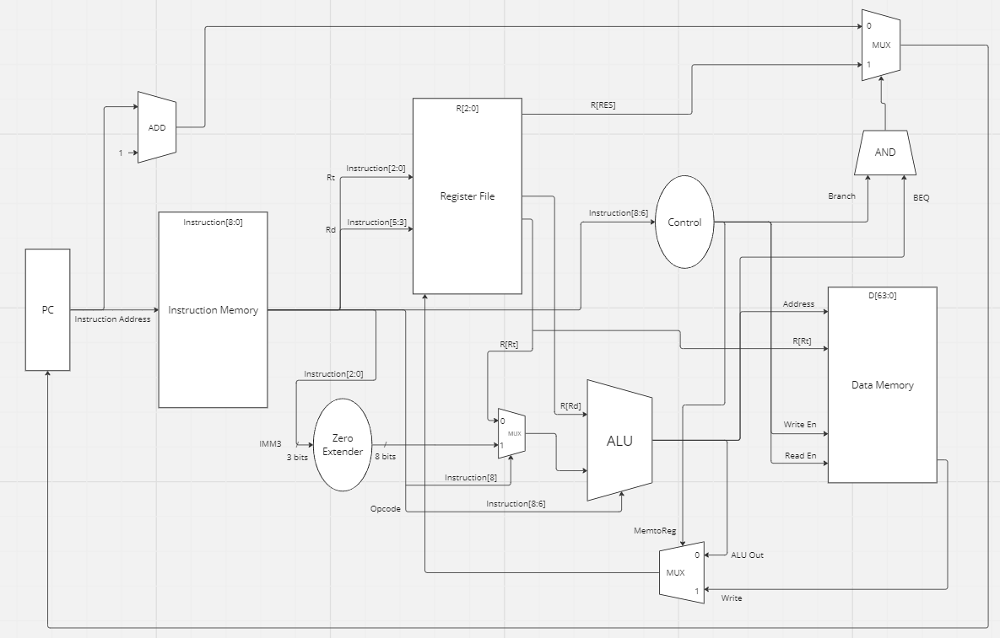

# Computer Architecture

## Architecture Diagram

## Budget: 9 bit instructions

| Type | Format | Instruction |
|----------|----------|----------|
| Register | 3 bit opcode, 3 bit operand register, and 3 bit operand register | MOV, NAND, ADD, LDR, STR |
| Immediate | 3 bit opcode, 3 bit operand register, and 3 bit immediate | SET, ROR |
| Branch | 3 bit opcode, 3 bit operand register, and 3 bit operand register | BNE |

## Registers
| Name | Purpose | Bit Code |
|----------|----------|----------|
| r0 | Special | 000 |
| r1 | General | 001 |
| r2 | General | 010 |
| r3 | General | 011 |
| r4 | General | 100 |
| r5 | General | 101 |
| r6 | General | 110 |
| RES | Special | 111 |

## Instructions
| Name | Type | Bit Breakdown |
|----------|----------|----------|
| MOV | R | 3 bit opcode (000), 3 bit operand register (XXX), and 3 bit operand register (XXX) |
| NAND | R | 3 bit opcode (001), 3 bit operand register (XXX), and 3 bit operand register (YYY) |
| ADD | R | 3 bit opcode (010), 3 bit operand register (XXX), and 3 bit operand register (YYY) |
| LDR | R | 3 bit opcode (011), 3 bit operand register (XXX), and 3 bit operand register (YYY) |
| STR | R | 3 bit opcode (100), 3 bit operand register (XXX), and 3 bit operand register (YYY) |
| SET | I | 3 bit opcode (101), 3 bit operand register (XXX), and 3 bit immediate (III) |
| ROR | I | 3 bit opcode (110), 3 bit operand register (XXX), and 3 bit immediate (III) |
| BNE | B | 3 bit opcode (111), 3 bit operand register (XXX), and 3 bit operand register (YYY) |

## Pseudo Instructions
| Name | Type | Combination |
|----------|----------|----------|
| AND | R | NAND r1 r2 |
|  |  | NAND r1 r1 |
| ORR | R | NAND r1 r1 |
|  |  | MOV RES r2 |
|  |  | NAND RES RES |
|  |  | NAND r1 RES |
| EOR | R | MOV r0 r1 |
|  |  | MOV RES r2 |
|  |  | NAND r0 r2 |
|  |  | NAND RES r0 |
|  |  | NAND r0 r1 |
|  |  | NAND r0 RES |
|  |  | MOV r1 r0 |